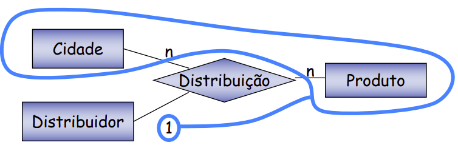
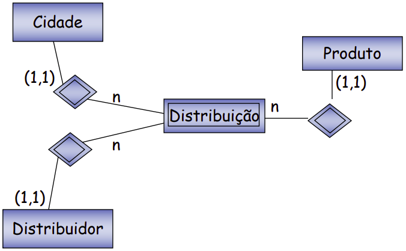
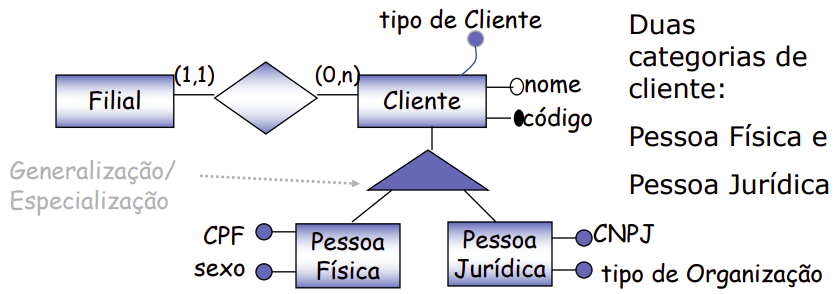
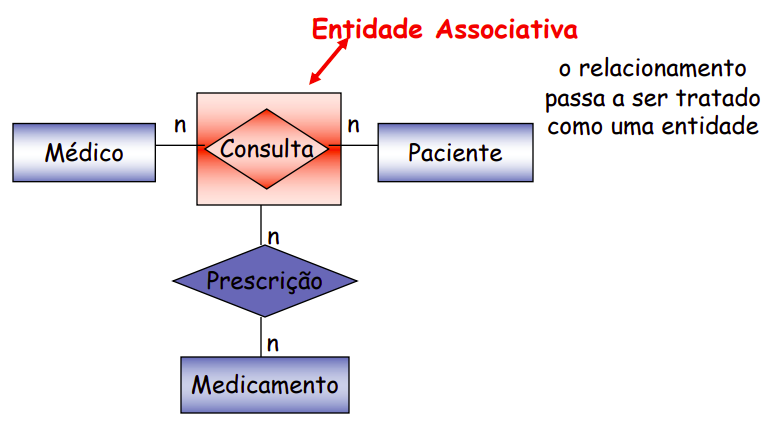
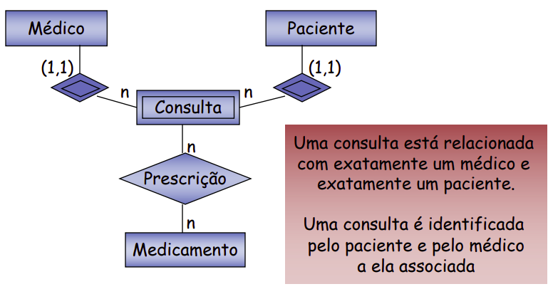

```{r setup, include=FALSE}
knitr::opts_chunk$set(echo = TRUE)
```

# Aula 1 e 2

## Consequências do compartilhamento de dados

- Compartilhamento de dados tem reflexo na estrutura do software
  - Estrutura interna de arquivos passa a ser mais complexa
  - Devem atender as necessidades dos diferentes sistemas
- Sistemas de Gerencia de Banco de Dados (SGBD)
  - permitem o uso compartilhado do dado e oferecem serviços para o gerenciamento e acesso ao dado.
  - preciso obedecer as estruturas definidas pelo SGBD utilizado

## Definições

- Banco de Dados
  - conjunto de arquivos integrados que atendem a um conjunto de sistemas.
- Sistemas de Gerência de Banco de Dados (SGBD)
  - software que incorpora as funções de definição, recuperação e alteração de dados em um banco de dados.

## Vantagens

- Redundância controlada
- Independência de Dados
  - Aplicações imunes de organizações lógicas e físicas dos dados e vice-versa
- Linguagem de acesso
- Recuperação de falhas

## Modelos de Dados – níveis de abstração

**Nível Físico** (tipo de dado de campos de tabela, localização física dos arquivos, tamanho dos arquivos) -> **Nível Lógico** (sql) -> **Nível Conceitual** (mer)

## Modelo Entidade-Relacionamento (MER)

- Técnica de modelagem conceitual

### Entidade

Isoladamente não informa nada   

Propriedades
- atributos;
- relacionamento;
- generalizações e especializações.

### Relacionamento

Conjunto de associações entre entidades sobre as quais deseja-se manter informações no BD.


#### Ternário 

<center>
{width=50%}
</center>


<center>
{width=50%}
</center>


### Generalização / Especialização

<center>
{width=50%}
</center>


### Entidade Associativa

<center>
{width=50%}
</center>


<center>
{width=50%}
</center>


