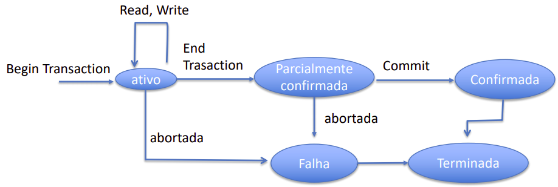
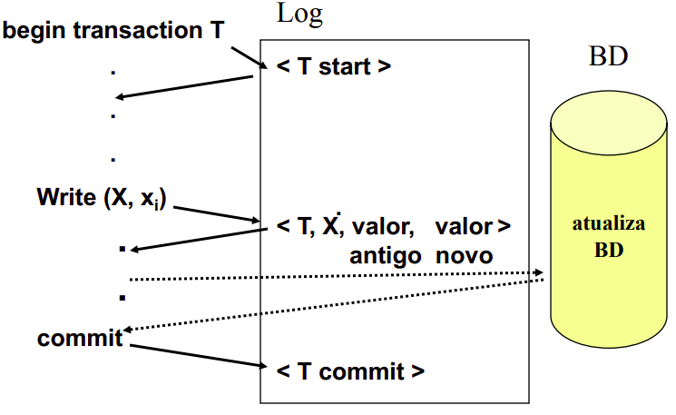

```{r setup, include=FALSE}
knitr::opts_chunk$set(echo = TRUE)
```

# Aula 1 e 2

## Consequências do compartilhamento de dados

- Compartilhamento de dados tem reflexo na estrutura do software
  - Estrutura interna de arquivos passa a ser mais complexa
  - Devem atender as necessidades dos diferentes sistemas
- Sistemas de Gerencia de Banco de Dados (SGBD)
  - permitem o uso compartilhado do dado e oferecem serviços para o gerenciamento e acesso ao dado.
  - preciso obedecer as estruturas definidas pelo SGBD utilizado

## Definições

- Banco de Dados
  - conjunto de arquivos integrados que atendem a um conjunto de sistemas.
- Sistemas de Gerência de Banco de Dados (SGBD)
  - software que incorpora as funções de definição, recuperação e alteração de dados em um banco de dados.

## Vantagens

- Redundância controlada
- Independência de Dados
  - Aplicações imunes de organizações lógicas e físicas dos dados e vice-versa
- Linguagem de acesso
- Recuperação de falhas

## Modelos de Dados – níveis de abstração

**Nível Físico** (tipo de dado de campos de tabela, localização física dos arquivos, tamanho dos arquivos) -> **Nível Lógico** (sql) -> **Nível Conceitual** (mer)

## Modelo Entidade-Relacionamento (MER)

- Técnica de modelagem conceitual

### Entidade

Isoladamente não informa nada   

Propriedades
- atributos;
- relacionamento;
- generalizações e especializações.

### Relacionamento

Conjunto de associações entre entidades sobre as quais deseja-se manter informações no BD.


#### Ternário 

<center>
{width=50%}
</center>


<center>
{width=50%}
</center>


### Generalização / Especialização

<center>
{width=50%}
</center>


### Entidade Associativa

<center>
{width=50%}
</center>


<center>
{width=50%}
</center>


# Aula 3

SGBD's
- composto por tabelas; 
- cada tabela: um conjunto de linhas; 
- cada linha: relação entre valores de atributos.

## Características do modelo relacional

**Domínio de atributos**: conjunto de valores permitidos para um atributo ou campo.

**Campos obrigatórios ou opcionais**: null ou not null.

**Chave**: usada para identificar tuplas e estabelecer relações entre tuplas. São restrições de integridade.

**Integridade Existencial**: associada ao conceito de chave primária; define que a chave primária não pode ser nula, nem ter valor já existente na tabela.

**Integridade Referencial**: associada a chave estrangeira; a chave estrangeira deve referenciar valores existentes na tabela referenciada. Atualizações podem originar violações das regras de integridade referencial.


# Aula 4

<center>
{width=50%}
</center>

## Transformação de Entidades

<center>
{width=50%}
</center>

Empregado(**CPF_emp**, nome_emp, end_emp, dataadm_emp, datanasc_emp)


## Transformação de Entidades Fracas

<center>
{width=50%}
</center>

Dependente(**matric-prof**, **nome-dep**, datanasc_dep)


# Aula 5

## Normalização

- Conceito próprio de BDR que objetiva eliminar redundância de dados de arquivos, permitindo a construção de relações que não apresentam anomalias quando são manipuladas.
- Permite o reagrupamento de informações para a obtenção de um modelo E-R.
- Formas Normais:
  - regras que originam tabelas bem projetadas
  - 1FN, 2FN, 3FN, BCNF, 4NF e 5NF

## Dependência Funcional

Dada uma relação (tabela) R , o atributo Y de R é funcionalmente dependente do Atributo X de R (R.X $\rightarrow$ R.Y) , se e somente se para cada valor de X tem a ele associado apenas um valor de Y.

Neste caso, diz-se que Y é dependente funcional de X ou que X determina o valor de Y.

## Primeira Forma Normal (1FN)

Diz-se que uma relação está na 1FN se e somente se todos os atributos contém somente valores atômicos.

_Banco de Dados Relacionais: as relações devem estar na 1FN_

### Anomalias da 1FN

- Insersão: não é possível incluir um novo item (cod e descr) sem existir um pedido.
- Eliminação: pode ocorrer a perda de informação sobre um item ao eliminar-se um pedido.
- Modificação: na alteração do preço unitário de um item, deve-se alterar todos os pedidos em que este aparece.


### 2ª opção para geração na 1FN:

Construir uma tabela para cada tabela aninhada

1. cria-se uma tabela na 1FN referente a tabela externa (sem tabelas aninhadas);
1. para cada tabela aninhada cria-se uma tabela na 1FN com os campos: chave-primária de cada uma das tabelas da qual ela é aninhada + colunas da própria tabela;
1. defini-se as chaves primárias de cada uma das tabelas criadas.


## Segunda Forma Normal (2FN)

Diz-se que uma tabela está na 2FN se e somente se ela estiver na 1FN e cada coluna não chave for dependente funcional completo da chave principal.


## Terceira Forma Normal (3FN)

Diz-se que uma tabela está na 3FN se e somente se ela estiver na 2FN e todo atributo não chave não depender de outro atributo não chave.

- eliminação de dependências entre atributos não chave; 
- eliminação de atributos derivados


## Forma Normal de Boyce/Cood (BCNF)

Diz-se que uma tabela está BCNF se e somente se os únicos determinantes são chaves candidatas.

- tabelas que tenham duas ou mais chaves candidatas e
- cada chave candidata (uma chave composta) apresente superposição em relação a algum atributo


## Quarta Forma Normal (4FN)

Diz-se que uma tabela está 4FN se e somente se estiver na 3FN e não apresentar dependências multivaloradas.

- dependência multivalorada: ocorre quando um dado valor da chave principal identifica repetidas vezes um conjunto de valores de atributos dependentes.


# Aula 10

## Estados da transação

<center>
{width=50%}
</center>

## Transação Terminada

- Quando uma transação termina com sucesso:
  1. transação finalizada com sucesso
  1. atualizações efetivadas (commited)
  1. muda o estado do banco
- Quando uma transação termina com sucesso: abortada
  1. transação abortada
  1. atualizações desfeitas
  1. rolled back
  
## Propriedade das Transações

ACID: atomicidade, consistência, isolamento, durabilidade.

### Atomicidade

Todas as operações são executadas e refletidas no BD ou nenhuma é.

### Consistência

A execução de uma transação isolada (sem concorrência) preserva a consistência do BD

### Isolamento

- Podem existir diversas transações em execução, atualizações feita por uma transação são "escondidas" da outra, até que a primeira termine.
- Uma transação deve aparecer ser executada isoladamente, como se só ela existisse, embora hajam diversas sendo executadas de forma simultânea. Em outras palavras, a execução de outras transações simultâneas não deve afetar a execução da outra. O nível de isolamento afeta diretamente a concorrência ao item de dado num ambiente multi-usuário.

### Durabilidade

Os efeitos da transação bem sucedida persistem no BD mesmo se houver falhas. Esta propriedade é assegurada pelo componente de gerenciamento de recuperação.

## Falhas

- Mais simples: que resultem em perda de informação na memória volátil.
- Há vários mecanismos que fazem o sistema voltar ao último estado consistente antes da ocorrência da falha.
- Alguns usam o “log” (arquivo que registra as alterações no BD; o log é implementado numa memória estável).

## Log – registro de transações

- As ações (reads e writes) de transação são registrados em meio não volátil
  - As operações são registradas de forma sequencial no log, na ordem que são executadas e apenas inserções são feitas no log;
  - Só depois são confirmadas;
  - Garante que mesmo em caso de falha no processo de atualização da base de dados, este será atualizado.
- Transações que são abortadas precisam ter seus efeitos desfeitos no banco no dados
- Os registros de operações no log dependem do uso pretendido (auditoria, recuperação de falhas)

### Exemplo de regstros de log
1. [start_transaction, T]
1. [write_item, T, X, valor_antigo, valor_novo]
1. [read_item, T, X, valor]
1. [commit, T]
1. [abort, T]

### Log incremental com atualização imediata

<center>
{width=50%}
</center>


## Pontos de Sincronismo (Checkpoints)

- após a falha, quando o sistema volta, o gerenciador de recuperação examina o log para tomar as providências cabíveis:
  - refazer (REDO) ou
  - desfazer (UNDO ou ROLLBACK) transações.
- é um processo demorado
- muitas das transações já atualizaram o BD, e acabam sendo refeitas sem necessidade.

- atualização do log (da memória principal) $\rightarrow$ memória estável (registros do log)
- atualização do BD - blocos de buffer (da memória principal) $\rightarrow$ disco
- registro <checkpoint> $\rightarrow$ log (em memória estável)

## Controle de Concorrência

- problema: ambientes multiusuário
  - num ambiente onde transações são executadas de modo concorrente a propriedade do isolamento pode não ser preservada.
- quando diversas transações concorrentes são executadas, suas operações podem ser intercaladas de modo inconvenientemente.


